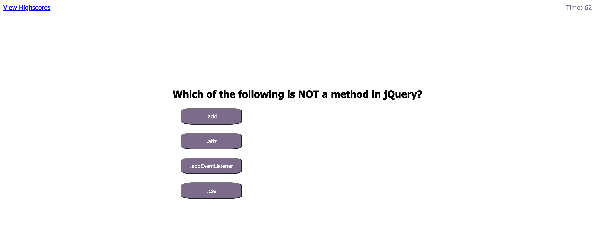

# Coding Quiz

## Description

URL: https://marysgreenwood.github.io/coding-quiz/

This server-side application provides timed quiz to test your coding knowledge

## Table of Contents

- [Installation](#installation)
- [Usage](#usage)
- [Contributing](#contributing)
- [Tests](#tests)
- [License](#license)
- [Questions](#questions)

## Installation

N/A

## Usage

his timed quiz offers multiple-choice questions on basic javascript and DOM manipulation. Any wrong answers will result in reduced time. Users have the option of saving their initials to be featured on the High Scores page

## Contributing

N/A

## Tests

N/A

## License

This project is licensed under the MIT license.
https://opensource.org/licenses/MIT

## Questions

Github: https://github.com/marysgreenwood
Email: marysgreenwood@gmail.com
